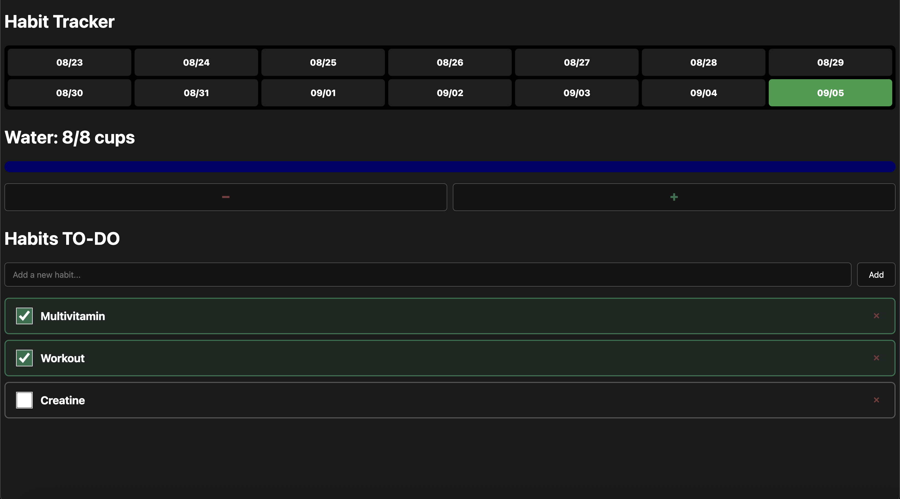

# Habit Tracker

A full-stack web app for tracking daily habits and water intake, with a GitHub-style
consistency grid showing your last two weeks of progress at a glance.

Built from scratch with Flask and SQLite as a way to learn full-stack web development —
every line of the backend, database schema, and frontend was written and debugged
personally.



## Features

- **Dynamic habit tracking** — add or delete your own habits (up to 4), each tracked
  as a simple daily checkbox
- **Water tracker** with a capped counter (0–8 cups), a live progress bar, and a
  color that shifts as you get closer to your goal
- **Consistency grid** — a 2-week, GitHub-heatmap-style grid where each day's color
  reflects what percentage of that day's habits were completed
- All data persists in a local SQLite database — refresh, close the tab, or restart
  the server and everything is exactly where you left it

## Tech stack

- **Backend:** Python, Flask
- **Database:** SQLite (via Python's built-in `sqlite3` module)
- **Frontend:** HTML, CSS, Jinja2 templating
- No JavaScript frameworks, no build step — everything renders server-side

## Running it locally

```bash
# Clone the repo
git clone https://github.com/MasonBartell/habit-tracker.git
cd habit-tracker

# Create and activate a virtual environment
python -m venv venv
source venv/bin/activate      # On Windows: venv\Scripts\activate

# Install dependencies
pip install flask

# Create the database and starter habits
python setup.py

# Run the app
python app.py
```

Then open `http://127.0.0.1:5000` in your browser.

## Design notes

The database uses two tables:

- **`habits`** — one row per habit, storing its name, type (`Checkbox` or `Counter`),
  and an optional numeric goal (used only by Water)
- **`logs`** — one row per completed action, linking a habit ID to a date and a value.
  Checkbox habits log a `1` when done; Water logs `+1`/`-1` per cup, summed per day

Keeping habits and logs in separate tables means adding a new habit or a new day
never requires changing the schema — everything scales by adding rows, not columns.

The consistency grid recalculates its scoring dynamically based on however many
habits currently exist, rather than assuming a fixed set — so the grid stays
accurate as habits are added or removed over time.

## What I'd add next

- User accounts, so the tracker supports more than one person
- Editing an existing habit's name instead of only add/delete
- A longer history view beyond the current 2-week window
